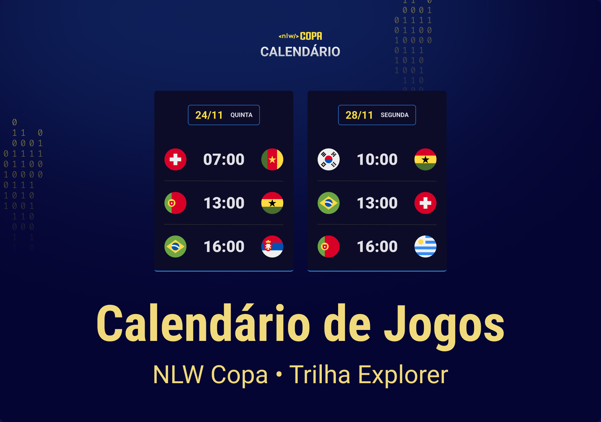

<h1 align="center"> NLW #10 Copa - Trilha Explorer </h1>

Evento exclusivo e gratuito, promovido pela Rocketseat para ensino de tecnologias WEB.

  <a href="#-tecnologias">Tecnologias</a>&nbsp;&nbsp;&nbsp;|&nbsp;&nbsp;&nbsp;
  <a href="#-projeto">Projeto</a>&nbsp;&nbsp;&nbsp;|&nbsp;&nbsp;&nbsp;
  <a href="#-layout">Layout</a>&nbsp;&nbsp;&nbsp;|&nbsp;&nbsp;&nbsp;
  <a href="#memo-licença">Licença</a>

 

  

## 🚀 Tecnologias

Esse projeto foi desenvolvido com as seguintes tecnologias:

- HTML e CSS
- JavaScript 
- Git e Github

## 💻 Projeto

O Calendário da Copa é um projeto que mostra os horários dos jogos do Brasil na Copa de 2022, no Catar.

## 🔖 Layout

Você pode visualizar o layout do projeto através [DESSE LINK](https://nlwworldcup.netlify.app/). Não é necessário ter conta no [SITE](https://nlwworldcup.netlify.app/) para acessá-lo.

## :memo: Licença

Esse projeto está sob a licença MIT.

---

Baseado no projeto da Rocketseat :wave: [Clique aqui para participar da comunidade.](https://discord.gg/rocketseat)
